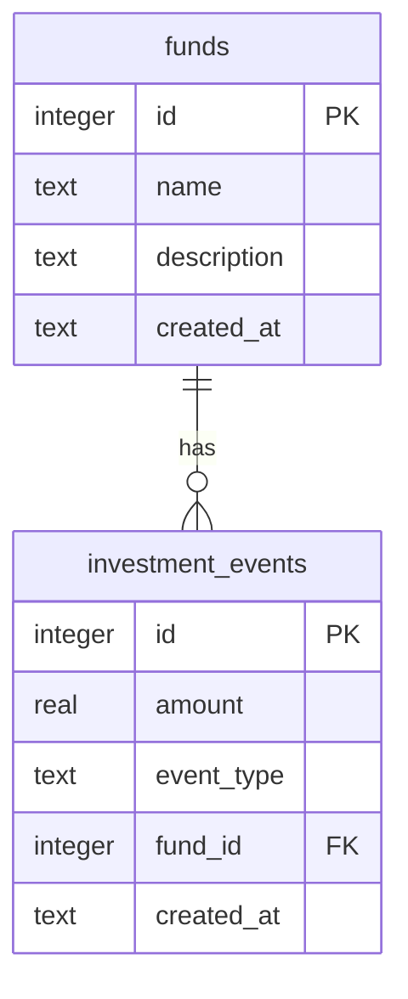

# ISAThing

A React Native mobile application that simulates an ISA (Individual Savings Account) investment platform. This app allows users to manage their ISA investments by making deposits, allocating funds to different investment options, and tracking their investment portfolio - all using local storage for demonstration purposes.

Key features:

- Make deposits to your ISA account
- Invest in various funds
- Track total investments and available funds
- ~~View investment history~~


https://github.com/user-attachments/assets/ca82e636-5925-4f26-bc7f-e89025972da0


## Requirements

- Node.js version 20
- Requires the ability to run ios projects generated by Prebuild
  https://docs.expo.dev/workflow/continuous-native-generation/#usage

## Get started

1. Install dependencies

   ```bash
   npm install
   ```

2. Build the app

   ```bash
    npx expo prebuild
   ```

3. Run the app

   ```bash
   npx expo run:ios
   ```

## Tests

```
npm run tests
```

## Assumptions

A set of assumptions and tech decisions i took to scope down and simplify the work.

- Authentication is already in place so we can focus on the core functionality. If the app is open, the user is logged in. Additionally, no attempt will be made to model a customer.
- No backend server. All data will be stored in a local sqlite database so this acts as our backend.
- This app targets retail customers only. There will be no mention of Employer based customers or functionality linking the two.
- The ISA account is assumed to already exist, so no attempt will be made to create or model one.
- The user cannot invest more than they have available into funds.
- We'll only work in whole £, no pence, cents, or fractions of.
- We only support GPB.
- Investments are synchronous and instant. The investment does not enter into a "clearing" state or a queue.

## Functional Requirements

1. Home Screen
   • Displays total investments.
   • Displays available funds.
   • Displays a list of past investments.
   • Allows user to navigate to the “Make Deposit” screen.
   • Allows navigation to the “New Investment” screen.

2. Make deposit Screen
   • Allows user to make a deposit.
   • Navigates back to Home Screen after deposit is made.

3. New Investment Screen
   • Displays a list of available investment funds.
   • Allows users to select a single fund.
   • Allows users to input an investment amount.
   • Redirects to the Home screen after investment is made.

## Architecture

### Database schema

I went with an event sourcing approach for the database schema.



Just 2 events are supported at the moment: `deposit` and `allocation`.

`deposit`
User deposits fund in the ISA account.

`allocation`
User allocates available funds in the ISA account. The fund allocation is identified by the fundID which is otherwise `null` for a deposit event.

\*\* This model could be improved by adding a `meta` field. The `meta` field could contain event specific data. So for deposit that would be `{ amount: int }` and for allocation `{ fund_id: int, amount: int }`.

Extending this model to support more event types such as `withdrawal` and `reallocation` should be straightforward. The `withdrawal` event would involve deducting funds from the ISA account, while the `reallocation` event would involve reallocating funds between different investment funds.

Supporting the allocation of multiple funds in a single transaction should also be straightforward as this would involve creating multiple `allocation` events with the same `created_at` timestamp, provided there are enough available moneys.

### TODO:

- tamagui
- zod schemas for forms
- show unit testing of one of the screens
